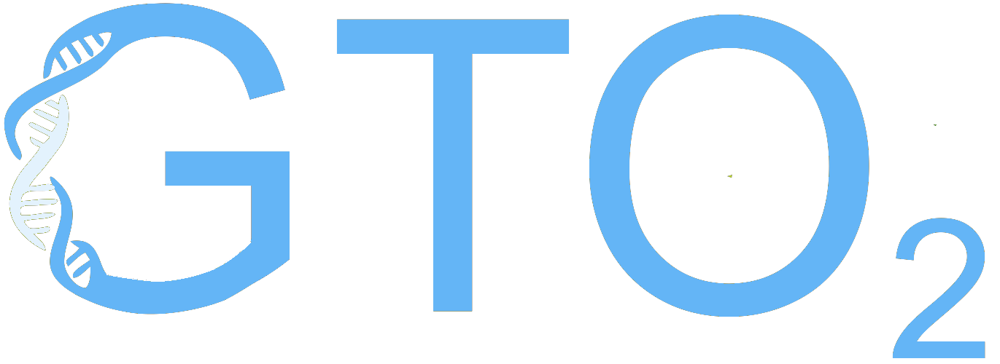

<b>The genomics-proteomics toolkit</b>

## Under development
Please wait for the next release

## ISSUES
Please let us know if there is any
[issues](https://github.com/cobilab/gto2/issues).

## LICENSE
GTO is under MIT license. For more information, click
[here](https://opensource.org/licenses/MIT).